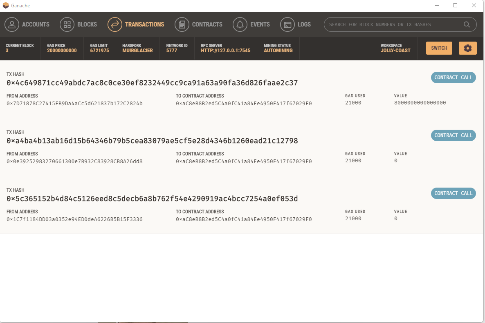
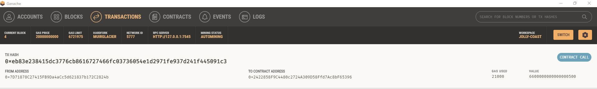

### Fintech_Finder

Customers of Fintech Finder can use the app to search through a list of candidates for fintech specialists, choose one, hire them, and then pay them using cryptocurrency integrated into the Ethereum blockchain network. Using the Genache app, the program also incorporates a nearby Ethereum blockchain network.

## Technologies
The following package from Python 3.7 is used in this project:

* [VSCode]

* [Streamlit] 

* [Web3.py] 

* [ethereum-tester] 

* [mnemonic] 

* [bip44] 

* [Ganache]

## Installation Guide

Before running the application first install the following dependencies.

Install Web3.py
```
pip install web3==5.17
```
Install ethereum-tester library
```
pip install eth-tester==0.5.0b3
```
Install mnemonic package
```
pip install mnemonic
```
Install bip44 package
```
pip install bip44
```
Download and install [ganache](https://trufflesuite.com/docs/ganache/quickstart/#1-install-ganache).
Install Streamlit
```
pip install streamlit
```

Run the streamlit application.
```
streamlit run fintech_finder.py
```
## Results Screenshot






## Contributors
Contributed by Nayana Narayanan.

## License
MIT License